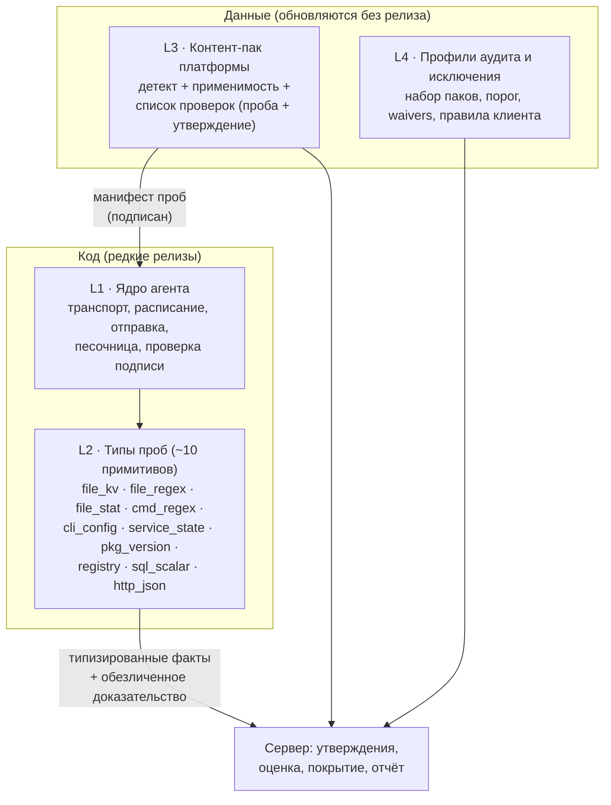
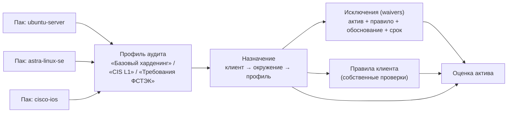

# Масштабируемая архитектура — контент-паки платформ и декларативные пробы

Уточнение постановки: система строится **не под одного заказчика**, а для компании, которая проводит аудиты харденинга у многих клиентов с разным, международным и российским, оборудованием. Значит, состав платформ заранее неизвестен и будет расти всё время. Критерий правильной архитектуры один: **добавление новой платформы или новой проверки — это добавление данных, а не разработка и не релиз агента.** Заметка развивает [Профили платформ](platforms.md) (там — «можно ли», здесь — «как, чтобы это масштабировалось»). Связано с «Оборудование и сбор данных — полная картина» *(заметка в vault `obsidian_hardening`)*, «Архитектура агентов сбора данных» *(заметка в vault `obsidian_hardening`)*.

## 0 · Три оси роста

| Ось | Что растёт | Чем это грозит, если не заложить сейчас |
|---|---|---|
| **Платформы** | Десятки ОС, СУБД, сетевых вендоров и продуктов, включая российские | Агент превращается в свалку `if platform == ...`; каждая платформа — релиз |
| **Клиенты** | Сотни организаций, у каждой свой состав, свои исключения и свои требования | Общий глобальный список правил не выдерживает: одному клиенту нужен профиль ФСТЭК, другому CIS, третьему — своё |
| **Время** | Правила уточняются, платформы обновляются | Меняется формула — «плывёт» история оценок; аудитор не может воспроизвести отчёт трёхмесячной давности |

## 1 · Где узкое место сейчас (по коду `volkodav`)

- **Правила — данные, а способ получения факта — код.** Правило `ssh.permit_root_login` лежит строкой в `hardening_rules`, но *как* его получить (`parse_sshd_config()`, регулярки) зашито в `agent/collector.py`. Любая новая проверка, которой нет среди семи существующих категорий, = правка кода агента = новая версия агента на всех хостах. Для аудиторской компании это неприемлемо.
- **`hardening_rules` глобальна.** Один набор на всех клиентов, без версий, без пакетов, без исключений на клиента/актив. Поле `source` — просто текст.
- **Движок понимает только равенство.** `evaluate_asset()` сравнивает `actual == expected` как строки. Проверки вида «≤ 4», «≥ 14», «входит в список», «строки нет в конфиге» приходится заранее сворачивать в булев факт внутри агента.
- **`compliance_score` считается только по `pass`/`fail`** (`compute_compliance_score()`). `error` («не смогли собрать») в оценке не участвует. Для платформы с неполным сбором это значит: **чем хуже поддержка платформы, тем лучше выглядит оценка.** В аудиторском продукте это опасно — нужна отдельная метрика покрытия (раздел 6).
- Мультиклиентный каркас **уже есть** и не переписывается: `auditor_organizations`, `client_organizations`, `environments`, ключ агента на организацию.

## 2 · Ключевое решение: четыре слоя, код только в двух



- **L2 — маленький закрытый набор универсальных примитивов**, общий для всех платформ. «Прочитать `ключ значение` из файла», «найти регулярку в выводе команды», «проверить, что строки нет в конфигурации сетевого устройства», «состояние сервиса», «версия пакета», «значение из реестра Windows», «скалярный SQL-запрос», «поле из JSON-ответа API». Их пишут один раз, по-настоящему тестируют, и они не растут вместе с числом платформ.
- **L3 — YAML-пак на платформу.** Вся платформенная специфика — в данных: как распознать платформу, какие пробы и с какими параметрами запускать, что считать нормой.
- **Что остаётся кодом**: транспорты и нестандартные источники (опрос центров управления по API, экзотика). Это «побег наружу» — обычный модуль из [Профили платформ — разное оборудование в одном агенте, включая российское](platforms.md) — и должен быть исключением, а не правилом.

Так же устроены зрелые аналоги — стоит опираться на их опыт, а не изобретать: политики SCA в Wazuh (YAML с декларативными проверками файлов/команд/регулярок), `.audit`-файлы сканеров уязвимостей, профили InSpec, связка XCCDF/OVAL в OpenSCAP. Полностью копировать формат необязательно (раздел 9), но идея «проверки — данные поверх ограниченного набора проб» везде одна и та же.

### 2.1 Как выглядит пак

Пример **иллюстративный** — формат, а не проверенное содержимое:

```yaml
pack: ubuntu-server
version: 1.0.0
maturity: baseline            # inventory | baseline | full | certified
verified_on: ["Ubuntu 22.04.4", "Ubuntu 24.04.1"]
tags: [linux-server, debian-family, ubuntu]
transport: local

detect:
  - probe: { type: file_kv, path: /etc/os-release, key: ID }
    equals: ubuntu

checks:
  - id: ssh.permit_root_login
    title: Запрет входа по SSH под root
    probe: { type: file_kv, path: /etc/ssh/sshd_config, key: PermitRootLogin,
             separator: whitespace, default: "prohibit-password" }
    assert: { op: in, value: ["no", "prohibit-password"] }
    severity: critical
    remediation: "PermitRootLogin no в /etc/ssh/sshd_config, systemctl reload ssh"
    refs: [{ source: "CIS Ubuntu 22.04", id: "5.1.20" }]
    control: PRIVILEGED-REMOTE-LIMITED

  - id: ssh.max_auth_tries
    probe: { type: file_kv, path: /etc/ssh/sshd_config, key: MaxAuthTries, default: "6" }
    assert: { op: lte, value: 4 }            # раньше это приходилось сворачивать в булев факт в коде агента
    severity: medium
```

Сетевое устройство — та же структура, другие пробы:

```yaml
pack: cisco-ios
transport: ssh
detect:
  - probe: { type: cmd_regex, cmd: "show version", pattern: "Cisco IOS Software" }
checks:
  - id: cisco_ios.http_server_disabled
    probe: { type: cli_config, cmd: "show running-config", match: '^ip http server' }
    assert: { op: absent }
    severity: medium
```

Российская платформа — **та же структура**, но конкретные пробы (какая утилита, какой файл, какой вывод) заполняются только после снятия на реальном образе. До этого пак не пишется «по памяти» и остаётся на уровне `maturity: inventory`:

```yaml
pack: astra-linux-se
maturity: inventory           # только детект и список ПО, пока нет стенда
checks: []                    # см. раздел 6 — покрытие будет показано как 0 %, а не как «всё хорошо»
```

### 2.2 Утверждения — на сервере, пробы — на агенте

Агент выполняет **только пробы** и отдаёт типизированные значения; сравнение делает сервер (`assert: {op: lte, value: 4}`). Следствия:

- Поправить порог, оператор или критичность правила = обновить данные на сервере, **без пересбора и без релиза агента**. Уже собранные факты можно перепрогнать по новой версии правил.
- Расширить движок сравнения до операторов `eq, ne, in, lte, gte, regex, exists, absent, absent_all` — небольшое изменение в `evaluate_asset()` вместо нынешнего строкового `==`.
- **Секреты не уезжают с хоста.** Агент отправляет значение (`MaxAuthTries=3`), а не файл целиком. Для аудита нужна ещё и **доказательная база** — поэтому к каждому факту добавляется короткое обезличенное свидетельство (совпавшая строка с замаскированными значениями). В конфигурациях сетевого оборудования есть хэши паролей и SNMP-community — отправлять «сырой» `running-config` на сервер нельзя.

### 2.3 Безопасность механизма — самый чувствительный момент

Агент, который выполняет описанные сервером пробы, — это по сути канал удалённого исполнения. Требования обязательны, без них схема небезопасна:

1. **Паки подписаны** ключом аудиторской компании; агент не исполняет манифест без проверки подписи.
2. **Только проба из закрытого списка L2**, с валидируемыми параметрами. Никакого произвольного `shell`. Команды — из белого списка шаблонов, пути — с жёстким запретом на чтение чувствительных файлов целиком (для `/etc/shadow` допустима проба `file_stat`, но не `file_kv`).
3. **Пробы только на чтение.** Модифицирующих проб не существует.
4. Каждый запуск манифеста логируется на стороне агента (что исполнено и по какому паку/версии).
5. Учётки для внешних транспортов (`ssh`/`api`) — read-only, секреты в отдельном хранилище, не в паке.

### 2.4 Приёмы из прежней заметки об адаптерах, которые остаются в силе

Прежняя заметка «Модель адаптеров» удалена (она предлагала универсальные ключи, что противоречит этой схеме; осталась в истории git, коммит `6ee2238`). Четыре её вывода перенесены сюда:

- **Платформу определяют по тому, что реально работает, а не по названию дистрибутива.** Один и тот же Ubuntu может держать `ufw` выключенным и настраивать `nftables` напрямую. Поэтому проверки файрвола — это отдельные проверки с пробой `service_state` (какой сервис активен), а не одно правило «ufw включён».
- **Версии внутри одного вендора.** Если отличается **набор источников данных** — нужен отдельный пак (Cisco IOS и NX-OS). Если отличается только **формат вывода той же команды** — достаточно варианта проверки внутри одного пака (`applies_to_version`). Разные версии Ubuntu отдельного пака не требуют.
- **Недоступная проба не равна нарушению.** Если на старой системе нет нужной команды (например, командлета PowerShell), проба возвращает «не поддерживается», и проверка получает статус `error`/«не применимо», а не `fail`. Так уже работает принцип «нет факта — не нарушение».
- **Структурированные интерфейсы вместо разбора текста.** Разбор вывода `show running-config` регулярками — рабочий, но хрупкий способ. Устройства с NETCONF/RESTCONF, REST API RouterOS или СУБД со служебными представлениями дают данные надёжнее. В этой схеме это просто **ещё один тип пробы** (`http_json`, `netconf`); пак платформы меняется, ядро и остальные паки — нет.

## 3 · Мультиклиентность: как паки превращаются в аудит конкретного клиента



Понятия (на уровне данных, а не готовая схема БД):

- **Пак** — глобальный, принадлежит аудиторской компании, версионируется (`1.0.0`, `1.1.0`), имеет статус (`draft`/`published`) и подпись.
- **Профиль аудита** — «какие паки и какие проверки входят в аудит и что считается порогом». Один и тот же пак участвует в нескольких профилях.
- **Назначение** — какой профиль действует для какого клиента/окружения. Это то, что определяет, какие проверки видит конкретный клиент; **глобальный список правил из `hardening_rules` перестаёт быть единым для всех**.
- **Исключение (waiver / accepted risk)** — «на этом активе это правило не выполняется осознанно, потому что …, до …». Без него любой реальный аудит превращается в бесконечные «fail», которые клиент уже принял. Обязательны обоснование, автор, срок действия.
- **Правила клиента** — собственные проверки, не попадающие в глобальные паки.

### 3.1 Воспроизводимость: каждый результат привязан к версии

Каждая запись `scan_check_results` должна содержать **версию пака и идентификатор проверки на момент прогона**. Иначе после обновления правил оценка за прошлый период либо «переедет», либо станет несопоставимой с текущей, а аудитор не сможет воспроизвести отчёт. Динамика `compliance_score` во времени (график тренда на дашборде) корректна только пока версия правил фиксирована для сравниваемых точек — версию надо показывать рядом.

## 4 · Как наполнять каталог, не написав всё вручную

Главная трудоёмкость — контент, а не код (см. [Профили платформ — разное оборудование в одном агенте, включая российское](platforms.md), §7). Стратегия:

| Источник | Что даёт | Оговорки |
|---|---|---|
| **CIS Benchmarks** | Самый известный набор для Ubuntu/RHEL/Windows/Cisco/СУБД | ⚠️ Проверить лицензию: бесплатное использование, как правило, ограничено некоммерческим; для коммерческой аудиторской услуги может понадобиться членство/лицензия. **Это юридический вопрос до начала импорта.** |
| **DISA STIG** | Публичные руководства по конфигурации | Свободный доступ; ориентированы на конкретные продукты и стандарты США |
| **Открытый контент SCAP/OVAL (например, ComplianceAsCode)** | Готовые машинно-читаемые проверки для ряда Linux-платформ | Проверить состав платформ и лицензию; годится как источник для **импортёра** XCCDF/OVAL → пак |
| **Руководства вендоров по безопасной настройке** | Единственный источник для многих платформ, в том числе российских | Ручное превращение в проверки |
| **ФСТЭК, ГОСТ, отраслевые требования** | Основа для профилей и привязки `control` для российского рынка | Привязка правил к пунктам требований — экспертная работа |
| **Собственные авторские проверки** | То, чего нет в открытых источниках | Для российских платформ это, вероятно, основной источник |

Практический смысл для компании: для международных платформ контент можно импортировать и адаптировать; для российских открытого готового контента такого уровня, как правило, нет — значит, **авторский контент по этим платформам становится собственным активом и отличием**, но требует дорогого ручного труда на стенде.

Каждая проверка хранит `refs` — откуда она взята (пункт бенчмарка, раздел руководства, требование). Аудитор должен уметь объяснить клиенту, **почему** это правило.

## 5 · Уровни зрелости платформы и честный статус поддержки

При сотнях платформ невозможно, чтобы все были поддержаны одинаково. Это надо выразить явно, а не скрывать:

| `maturity` | Что есть | Что можно сказать клиенту |
|---|---|---|
| `inventory` | Детект платформы + версия + список ПО, проверок нет | «Мы видим это оборудование, но харденинг для него не оцениваем» |
| `baseline` | 10–30 ключевых проверок, прогнаны на стенде | «Базовая гигиена проверена» |
| `full` | Полный бенчмарк платформы, привязка `control` | Полноценный аудит |
| `certified` | `full` + подтверждено на перечисленных версиях (`verified_on`) + сверено вторым экспертом | Можно ссылаться в отчёте как на основание |

## 6 · Покрытие: без него оценка вводит в заблуждение

Так как `error` сейчас не входит в `compliance_score`, платформа с полусобранными данными выглядит «чистой». Нужны две метрики рядом:

- **`compliance_score`** — доля выполненных **из проверенных**.
- **`coverage`** — сколько проверок пака реально удалось выполнить и насколько пак покрывает платформу: `выполнено / всего в паке` и `проверок в паке / ориентир полного бенчмарка`.

На дашборде и в отчёте показывать оба числа; при низком покрытии — явный статус «оценка неполная». Для `maturity: inventory` оценка не показывается вовсе, а не выставляется как 100 %.

## 7 · Приоритеты каталога

Это рекомендация по очерёдности для компании-аудитора (не привязана к клиенту); реальный порядок зависит от того, что компания продаёт, и от доступных образов.

| Волна | Платформы | Почему |
|---|---|---|
| **1 · Основа** | Linux (Debian/Ubuntu, RHEL-семейство), Windows Server/10/11, Cisco IOS, PostgreSQL, Docker; российские ОС — Astra Linux, РЕД ОС, Альт | Максимальная встречаемость; для Linux-семейства пак переиспользует общие пробы (`file_kv` по `sshd_config` одинаков) |
| **2 · Расширение** | MikroTik, Eltex, MySQL/MariaDB, MS SQL, российские сборки PostgreSQL (Postgres Pro, Tantor), Kubernetes | Типичный парк средних и крупных организаций |
| **3 · Центры управления и облака** | Российские NGFW и криптошлюзы (Континент, ViPNet, UserGate, PT и др.) через API/центр управления, публичные и российские облака, Active Directory | Нужны транспорты `api` и отдельные модули; требуют доступа к продуктам |

Оговорка: **на волнах 2–3 стоит начинать только тогда, когда есть стенд или образ** — иначе пак останется на уровне `inventory`.

## 8 · Порядок реализации

Краткая версия с чекбоксами статуса — [Дорожная карта агента — 5 этапов](roadmap.md).

Идёт не «платформа за платформой», а сначала фундамент, потом доказательство на нескольких платформах.

| Этап | Что делаем | Критерий готовности |
|---|---|---|
| **0 · Фундамент** | Формат пака, набор проб L2, транспорт `ssh` для сетевых устройств, манифест + подпись, `platform_tags` в ingest, расширенные операторы в движке, версия пака в результатах, метрика `coverage` | Тесты движка и проб проходят |
| **1 · Перенос существующего** | 14 нынешних правил и `collector.py` → первый пак `ubuntu-server` | Результаты на тех же данных **идентичны** текущим (регрессия по 28 существующим тестам) |
| **2 · Доказательство масштабируемости** | Ещё два пака разной природы: Linux-семейство (Astra или РЕД ОС) и сетевое (Cisco IOS) | **Оба добавлены только YAML-паками, без изменения кода агента и бэкенда** — это и есть главный тест архитектуры |
| **3 · Инструменты автора** | Валидатор пака, запуск проверок на fixture-образцах вывода (`pack test`), импортёр XCCDF/OVAL | Новую проверку можно написать и протестировать без запуска агента на живом хосте |
| **4 · Профили клиентов** | Профили аудита, назначение, исключения, правила клиента, отчёты «по контролям» | Два клиента с разными профилями на одних и тех же паках |

## 9 · Открытые решения

| # | Решение | Рекомендация |
|---|---|---|
| 1 | Где оценивать: пробы на агенте + утверждения на сервере, или отправлять сырые данные | **Пробы на агенте + утверждения на сервере** (раздел 2.2): секреты не покидают хост, правила правятся без пересбора |
| 2 | Свой YAML-формат или совместимость с XCCDF/OVAL | ✅ **Решено 2026-09-20: свой YAML-формат + импортёр XCCDF/OVAL.** Проверки пишутся в простом собственном виде; готовые наборы в стандартном формате загружаются через «переводчик» (импортёр). Начинаем с собственного формата (этапы 0–2), импортёр — этап 3, добавляется позже без переделки написанных паков |
| 3 | Лицензия CIS | Вопрос к юристу до импорта; при сомнении опираться на STIG, открытый SCAP-контент, вендорские руководства и авторские проверки |
| 4 | Какие российские платформы первыми | Зависит от продуктовой стратегии компании и наличия образов; в волне 1 — Astra, РЕД ОС, Альт как самые распространённые ОС |
| 5 | Транспорт для сети: агент на джамп-хосте или облачный коллектор | Джамп-хост в контуре клиента (сеть управления не выставляется наружу); это отдельная тема — см. «Архитектура агентов сбора данных» *(заметка в vault `obsidian_hardening`)* |

## 10 · Что это меняет в проекте

- **`agent/collector.py`** → ядро + проба-движок; текущие `collect_*` становятся паком `ubuntu-server`.
- **`hardening_rules`** → структурированные проверки внутри версионируемых паков (`probe`, `assert`, `refs`, `control`); нынешняя плоская таблица мигрирует в первый пак.
- **`evaluate_asset()`** → операторы сравнения, привязка результата к версии пака, метрика покрытия.
- **`scan_check_results`** → колонки версии пака/проверки.
- **Новое:** профили аудита, назначения, исключения.
- **Не меняется:** мультиклиентный каркас (`client_organizations`, `environments`, ключи агентов), путь `/api/ingest`, история сканов.

## Словарь терминов

Для тех, кто не знаком с темой:

| Термин | Простыми словами |
|---|---|
| **Платформа** | Конкретный вид оборудования или ПО: Ubuntu, Astra Linux, Cisco IOS, PostgreSQL |
| **Пак** (контент-пак) | Файл-инструкция для одной платформы: что проверять и что считать нормой |
| **Формат пака** | Правила записи такого файла, чтобы его мог прочитать и человек, и программа |
| **YAML** | Простой текстовый способ записи данных списком с отступами; читается почти как обычный текст |
| **XCCDF / OVAL** | Международный стандарт записи проверок безопасности на языке XML; громоздкий, но для него есть много готовых наборов |
| **Импортёр** | «Переводчик»: превращает готовый набор проверок в стандартном формате в наш YAML-формат |
| **Проба** | Одно простое действие агента на проверяемой системе: прочитать значение из файла, найти строку в выводе команды, узнать статус службы. Только чтение, ничего не меняет |
| **Утверждение** (assert) | Условие, с которым сервер сравнивает найденное значение: «должно быть „no“», «не больше 4», «строки не должно быть» |
| **Профиль аудита** | Набор паков и проверок под конкретную цель: «базовый харденинг», «CIS», «требования ФСТЭК» |
| **Исключение** (waiver) | Осознанное «это правило здесь не выполняется, потому что …, до …»; хранится с обоснованием и сроком |
| **Покрытие** (coverage) | Какая доля проверок платформы реально выполнена; нужна, чтобы неполный сбор не выглядел как «всё хорошо» |
| **Зрелость** (maturity) | Насколько полно и надёжно платформа поддержана: только обнаружение → базовые проверки → полный набор → подтверждено на стенде |
| **Стенд** | Реальная или виртуальная установка платформы, на которой проверяют, что команды и проверки работают так, как задумано |

## Связанные заметки

- [Профили платформ — разное оборудование в одном агенте, включая российское](platforms.md) — почему универсальных ключей нет и как выглядит каталог платформ
- «Оборудование и сбор данных — полная картина» *(заметка в vault `obsidian_hardening`)* — что собирается сегодня
- «Архитектура агентов сбора данных» *(заметка в vault `obsidian_hardening`)* — спецификация флота и транспорты
- «Статус агента на 2026-09-12» *(заметка в vault `obsidian_hardening`)* — реальный статус реализации
