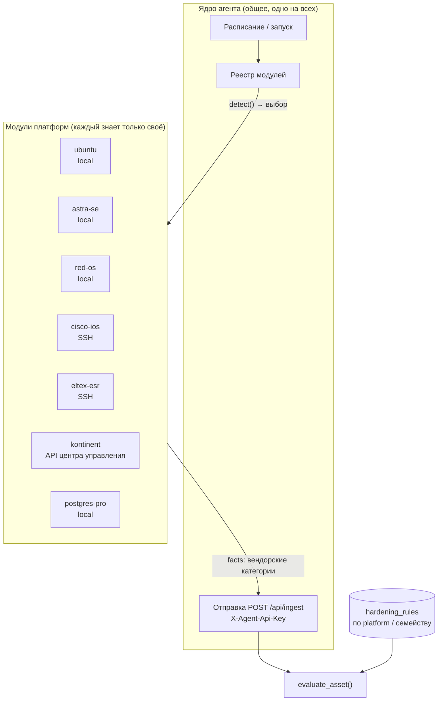
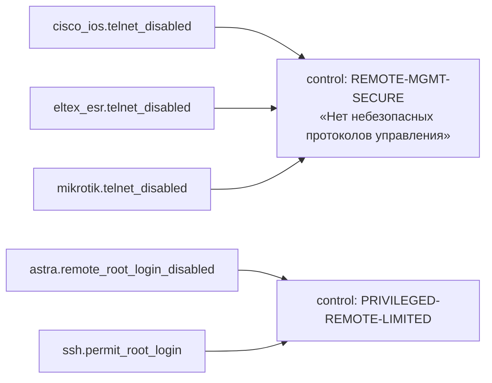

# Профили платформ — разное оборудование в одном агенте, включая российское

Вопрос: можно ли в одном агенте держать разные функции под разное оборудование — и как это делать, если оборудования много, оно международное **и российское**, а «подгонять всё под одно» не подходит. Заметка заменяет прежний подход «свести вывод всех вендоров к универсальным ключам (`network.*`)» (та заметка удалена, она осталась в истории git) и объясняет, почему от него отказались. **Как именно строить это масштабируемо — в [Масштабируемая архитектура — контент-паки платформ и декларативные пробы](architecture.md); эта заметка отвечает на вопросы «можно ли» и «какое оборудование бывает».** Связано с «Оборудование и сбор данных — полная картина» *(заметка в vault `obsidian_hardening`)*, «Архитектура агентов сбора данных» *(заметка в vault `obsidian_hardening`)*, «Статус агента на 2026-09-12» *(заметка в vault `obsidian_hardening`)*.

## 0 · Ответ коротко

**Да, можно.** Один агент = одно ядро + набор независимых **описаний платформ**. Каждое описание знает *только* своё оборудование: как его распознать, что и чем с него снять, какие факты отдать. Ядро (расписание, ключ, отправка в `/api/ingest`) про оборудование ничего не знает и общее для всех. В основном описание платформы — это **данные (пак в формате YAML)**, а не код; кодовый модуль нужен лишь для нестандартных источников (см. §3.1).

Принципиальное отличие от прошлой заметки: **факты и правила остаются вендорскими** (`astra.mac_enabled`, `eltex_esr.telnet_disabled`). Ничего не нормализуется «в одно» — приводить к общему виду нужно только *отчёт*, и это делается отдельным тегом на правиле (раздел 4), а не пересборкой фактов.

## 1 · Почему универсальные ключи не подходят

1. **Не всё имеет аналог.** У Astra Linux SE есть мандатный контроль целостности, мандатное управление доступом и замкнутая программная среда — у Ubuntu аналога нет. Ключ `linux.mac_enabled` либо потеряет смысл, либо сведёт три разных механизма в один булев флаг. То же для ГОСТ-криптографии в российских VPN/МЭ.
2. **Нормализация — это работа на каждый вендор × каждый факт**, причём с потерей информации. Для российской платформы такая работа ещё и не окупается: готовых бенчмарков (как CIS для Ubuntu/RHEL/Cisco) под неё обычно нет, правила всё равно придётся писать по документации вендора.
3. **Проверять нужно именно то, что специфично.** Для клиента с сертифицированной ОС важнее всего проверить как раз штатные механизмы защиты этой ОС, а не их «общий знаменатель».

## 2 · Что говорит текущий код

Проверено по `volkodav` (`agent/collector.py`, `app/services/hardening_engine.py`, `app/schemas/ingest.py`):

| Место | Как сейчас | Что это значит для разного оборудования |
|---|---|---|
| `collect_facts()` в `collector.py` | Жёсткий список: SSH, firewall (только `ufw`), updates (только `apt`), password_policy, kernel, docker — вызываются **безусловно** | Агент фактически «Ubuntu-only»: на любой другой платформе часть категорий молча не соберётся |
| `asset_type` | Приходит из аргумента командной строки `--asset-type`, агент сам ничего не определяет | Платформа не распознаётся автоматически |
| `evaluate_asset()` | Правило применяется, если `rule.product_type` пуст **или точно равен** `asset_type` | Уже сейчас можно завести правило только для одной платформы — **менять схему БД для этого не нужно**. Но одно значение `asset_type` не выражает иерархию «Astra ⊂ Debian-семейство ⊂ Linux» |
| `hardening_rules.rule_code` | `UNIQUE`, формат `категория.ключ` | Вендорские правила обязаны иметь вендорскую категорию: `astra.*`, `eltex_esr.*`. Так и задумано |
| `IngestAssetIn` | Есть `os`, `asset_type`, нет вендора/продукта/версии | Нужно одно новое поле — см. раздел 5 |

То есть основа для «разные функции под разное оборудование» уже есть в движке; не хватает выбора модуля на стороне агента и способа выразить иерархию платформ.

## 3 · Архитектура: ядро + описания платформ



### 3.1 Контракт кодового модуля (исключение, а не правило)

> [!NOTE]
> **Уточнено 2026-09-20**
> Основной путь добавления платформы — YAML-пак с декларативными пробами, без кода ([Масштабируемая архитектура — контент-паки платформ и декларативные пробы](architecture.md)). Кодовый модуль ниже нужен только там, где пробами не обойтись: опрос центров управления по API, экзотические транспорты.

Кодовый модуль — самостоятельный сборщик со своим набором фактов, а не «адаптер к универсальной схеме». Общий у всех только контракт:

```python
class PlatformModule:
    platform_id: str            # "astra-se", "eltex-esr", "cisco-ios", "postgres-pro"
    tags: list[str]             # ["linux-server", "debian-family", "astra-se"] — для выбора правил
    transport: str              # "local" | "ssh" | "api" | "snmp"

    def detect(self, target) -> bool: ...      # это моё оборудование?
    def collect(self, target) -> dict: ...     # {"astra": {...}, "ssh": {...}} — любые категории
    def software(self, target) -> list[dict]: ...
```

Одна и та же платформа может отдавать и **общие** категории (`ssh.*`, если это тот же OpenSSH — переиспользуется общий парсер `sshd_config`), и **свои** (`astra.*`). Переиспользуется код там, где оборудование действительно одинаково, а не потому что «так надо».

### 3.2 Четыре транспорта — вот где реально различается оборудование

Разное оборудование отличается не только командами, но и **способом добраться до данных**. Модуль обязан объявить транспорт, ядро использует его для логистики (где запускать, какие права/секреты нужны):

| Транспорт | Как собирается | Типичные представители | Что нужно ядру |
|---|---|---|---|
| `local` | Агент запущен на самом хосте, читает файлы и команды | Linux-ОС (Ubuntu, Astra, РЕД ОС, Альт), Windows, СУБД и Docker на хосте | Ничего лишнего — работает как сейчас |
| `ssh` | Внешний коллектор заходит на устройство по SSH, читает конфигурацию | Cisco IOS, Eltex MES/ESR, MikroTik, S-Terra | Инвентарь целей, read-only учётка, хранилище секретов |
| `api` | Опрос REST/иного API устройства или **центра управления** | Российские NGFW и криптошлюзы с центральным управлением, DBaaS | URL, токен, TLS-настройки |
| `snmp` | Опрос по SNMP (только чтение) | Простое сетевое оборудование, где нет CLI-доступа | v3-учётка |

Для ряда российских средств защиты (см. раздел 6) данные надёжнее снимать **не с самого устройства, а с системы централизованного управления** — модуль тогда один на центр, а «активы» — то, что он управляет.

### 3.3 Как агент выбирает платформу

Два способа выбирают **пак (или кодовый модуль)** платформы, а не адаптер к общей схеме:

1. **Явно, из инвентаря** (основной): `platform: eltex-esr` в `inventory.yaml` для сети и СУБД. Надёжно и не требует угадывания.
2. **Автоопределение** (для `local`): по `/etc/os-release` (`ID`, `ID_LIKE`, `VERSION_ID`) и по характерным маркерам платформы (например, наличие утилит вендора). Автоопределение всегда проверяется: если инвентарь и детект расходятся — это само по себе находка.

Если ни один модуль не подошёл — агент **не гадает** и не подставляет Ubuntu-набор по умолчанию. Он отправляет актив с пустым `facts` и понятной пометкой «платформа не поддерживается», движок ставит `error` — тот же принцип «нет факта — не нарушение».

> ⚠️ Точные значения `ID` в `/etc/os-release` для российских дистрибутивов нужно снять на реальных образах перед реализацией — по памяти их фиксировать не стоит.

## 4 · Общая отчётность без унификации фактов

Единственное, что действительно нужно обобщать, — это **смысл требования**, чтобы можно было сказать клиенту аудита «у вас 87 % по требованию „нет небезопасных протоколов управления“» по всему парку. Это решается **тегом на правиле**, а не преобразованием фактов:



- Каждое правило остаётся вендорским, со своим `rule_code`, командой, ожиданием и рекомендацией по исправлению.
- Дополнительная необязательная колонка `hardening_rules.control_id` объединяет правила одного смысла. Отчёт «по контролям» строится группировкой; отчёт «по платформе» — как сейчас.
- Тот же тег — естественное место для привязки к нормативке (требования ФСТЭК России, ГОСТ Р 57580 для финансовых организаций, приказы по ПДн/КИИ и т. п.): один контроль — одна или несколько ссылок на пункты требований. Какие именно пункты — вопрос к экспертам по нормативной базе, в этой заметке они не фиксируются.

Итого: **факты — вендорские, правила — вендорские, сравнение — универсальное (оно и так универсально), отчёт — по желанию сгруппирован по смыслу.**

## 5 · Что менять в проекте (минимально)

| # | Где | Изменение | Объём |
|---|---|---|---|
| 1 | `agent/collector.py` | Превратить в ядро + движок проб; нынешние `collect_*` становятся первым паком `ubuntu-server` (подробно — этапы 0–1 в [Масштабируемая архитектура — контент-паки платформ и декларативные пробы](architecture.md)) | Рефакторинг без новой логики |
| 2 | `IngestAssetIn` | Поле `platform_tags: list[str]` (напр. `["linux-server","debian-family","astra-se"]`) | 1 поле |
| 3 | `evaluate_asset()` | Правило применяется, если `product_type` пуст **или входит в** `{asset_type} ∪ platform_tags`. Сегодня — точное равенство одной строке | Одна строка условия |
| 4 | `hardening_rules` | Колонка `control_id` (nullable), миграция Alembic | Опционально, для сводной отчётности |
| 5 | Существующие 14 правил | Проставить `product_type` — SSH/парольная политика/ядро → `linux-server`, `ufw` → `debian-family` (с оговоркой из раздела 6), `postgres.*` → по движку | Миграция данных |

Теги вместо дерева платформ — сознательно: не нужна таблица иерархии, а правило «для всех Linux» и «только для Astra» выражаются одним и тем же полем `product_type`. Общее SSH-правило (`product_type=linux-server`) автоматически применится к Astra, РЕД ОС и Ubuntu; `astra.*` — только к Astra.

## 6 · Каталог оборудования: международное и российское

Обозначения в колонке «Уверенность»: 🟢 механизм понятен, можно закладывать; 🟡 направление верное, **точные команды/пути надо сверить с документацией вендора**; 🔴 нужен стенд или доступ к продукту — без этого проектировать сбор нельзя.

### 6.1 Операционные системы (`local`)

| Платформа | Чем отличается от Ubuntu | Что специфично проверять | Уверенность |
|---|---|---|---|
| **Ubuntu / Debian** | — (это то, что уже реализовано) | `ufw`, `apt`, `pam_faillock` | 🟢 |
| **Astra Linux** (Special/Common Edition) | Основа Debian → `dpkg`, `sshd_config`, большинство путей совпадают. Сертифицированная ОС со своим КСЗ | Режим защиты (базовый/усиленный/максимальный), мандатный контроль целостности, мандатное управление доступом, замкнутая программная среда, блокировки интерпретаторов и `ptrace`, гарантированное удаление, очистка памяти | 🟡 модуль строится на переиспользовании Debian-кода, но набор `astra.*` фактов — по руководству по КСЗ конкретной версии |
| **РЕД ОС** | RPM-семейство: `rpm`/`dnf`, `firewalld`, а не `ufw`/`apt` | Firewall через `firewalld`, обновления через `dnf-automatic`, SELinux/мандатные механизмы конкретной версии | 🟡 |
| **Альт (Сервер/Рабочая станция)** | RPM-семейство (`apt-rpm`); настройки безопасности переключаются штатной утилитой `control`, а не правкой файлов | Состояния `control`-фасилити (sshd, sudo, su, PAM/парольная политика) — читаются командой, а не из конфига | 🟡 — хороший пример, почему нельзя «просто читать `sshd_config`» |
| **РОСА, Эльбрус ОС, Аврора и др.** | Разные основы (в т. ч. другая аппаратная архитектура) | Определяется востребованностью и наличием стенда | 🔴 включать только при наличии спроса и образа |

Важное следствие из уже написанного кода: **`firewall.ufw_enabled` — это Ubuntu-факт, а не «фаервол Linux»**. На РЕД ОС и Альт его не будет; для них нужны модули с `firewall.firewalld_*`/`nftables` (или вендорские аналоги), а не попытка вписать их в `ufw_enabled`.

### 6.2 Сетевое оборудование и средства защиты (`ssh` / `api` / центр управления)

| Платформа | Транспорт (предположительно) | Особенность | Уверенность |
|---|---|---|---|
| **Cisco IOS / IOS-XE** | `ssh` | Уже разобрано в «Оборудование и сбор данных — полная картина» *(заметка в vault `obsidian_hardening`)*, §3.3; факты остаются `cisco.*` | 🟢 |
| **MikroTik RouterOS** | `ssh` / `api` | `/export`, `/ip service`; факты `mikrotik.*` | 🟢 |
| **Eltex** (коммутаторы MES, маршрутизаторы ESR и др.) | `ssh` | CLI у MES близок по стилю к Cisco-подобному; у ESR — своя модель конфигурации. Не копировать Cisco-модуль, а писать отдельные | 🟡 |
| **S-Terra Gateway** и подобные криптошлюзы | `ssh` | Совмещает сетевую часть и ГОСТ-криптографию; проверять надо и параметры сети, и параметры защищённых туннелей | 🟡 |
| **Континент (Код безопасности), ViPNet (Инфотекс)** | `api` / выгрузка из **центра управления** | Конфигурация ведётся централизованно; надёжнее опрашивать управляющий узел, чем каждое устройство | 🔴 нужен доступ к продукту/документации |
| **UserGate, PT NGFW, Ideco и другие российские NGFW** | `api` | Как правило, есть программный интерфейс; состав фактов зависит от продукта и версии | 🔴 |
| **Прочее российское сетевое** (Qtech, Zelax и др.) | `ssh` / `snmp` | Определяется востребованностью и наличием стенда | 🔴 |

### 6.3 СУБД (`local` — чтение конфигов на хосте)

| Платформа | Особенность | Уверенность |
|---|---|---|
| **PostgreSQL** | Реализованное правило `postgres.ssl_enabled`; пути `postgresql.conf`/`pg_hba.conf` | 🟢 |
| **Postgres Pro, Tantor и другие сборки на основе PostgreSQL** | Форк PostgreSQL → переиспользуется модуль `postgres`, различия в путях установки, названиях параметров и **дополнительных механизмах защиты** (аудит, шифрование, свои расширения) — они добавляют факты в свою категорию | 🟡 |
| **Jatoba, РЕД База Данных, Линтер и др.** | Отдельные СУБД со своими конфигурациями; переиспользовать PostgreSQL-модуль нельзя | 🔴 |

### 6.4 Контейнеры и виртуализация

Docker — сделано частично. Российские платформы виртуализации и контейнерной оркестрации (zVirt, Deckhouse и др.) — управляются через свои API/консоли; включать модулем `api` только когда есть доступ к продукту и спрос на эту платформу. 🔴

### 6.5 Прикладные средства защиты на хосте (отдельный тип модулей)

Антивирус/СЗИ от НСД (Kaspersky, Dr.Web, Secret Net Studio и т. п.) — это не «оборудование», но клиенты аудита, скорее всего, будут ожидать проверки, что **средство защиты установлено, запущено, базы актуальны**. Это самостоятельная категория фактов (`av.<продукт>.*`) и отдельный модуль на продукт. 🔴 — зависит от востребованности у клиентов и доступности продуктов.

## 7 · Главный риск: контент правил, а не код

Технически «много платформ в одном агенте» — обычная плагинная архитектура; она решается, и заметно проще, чем кажется, потому что движок сравнения уже универсален. Настоящий объём работы — **написать сами правила** для каждой платформы:

- для Ubuntu/RHEL/Cisco — есть готовая база (CIS Benchmarks), правила можно адаптировать;
- для российских платформ — готовых открытых бенчмарков такого же уровня, как правило, нет; источники — руководства вендора по безопасной настройке, профили защиты и методические документы ФСТЭК, ГОСТ. Каждое правило требует ручной проверки на реальной установке;
- каждое правило должно пройти проверку на **стенде**: без реальной Astra/РЕД ОС/Eltex нельзя честно написать команду сбора — можно только предположить.

Отсюда практический вывод: **каталог платформ растёт постоянно, поэтому архитектура должна делать добавление платформы добавлением данных, а не кода**, и честно показывать степень покрытия каждой платформы. Как именно — в [Масштабируемая архитектура — контент-паки платформ и декларативные пробы](architecture.md).

## 8 · Как определять состав каталога

Система строится для аудиторской компании, а не под одного заказчика, поэтому состав платформ определяется не опросом конкретной организации, а **рынком и стратегией компании**: что чаще всего встречается у клиентов, что компания готова продавать и на что есть стенд или образ для проверки. Очерёдность (волны) и уровни зрелости поддержки платформы — в [Масштабируемая архитектура — контент-паки платформ и декларативные пробы](architecture.md), разделы 5 и 7. Вопросы к конкретному клиенту (какая ОС, какие сети) остаются вопросами **этапа обследования аудита**, а не проектирования продукта.

## 9 · Чек-лист: добавить новую платформу

1. Определить `platform_id`, набор `tags` (класс → семейство → продукт) и **транспорт**.
2. Снять на стенде: чем детектируется платформа, какие команды/файлы/API дают нужные значения. Записать реальный вывод в заметку, а не предположение.
3. Написать **пак**: секция `detect` и список `checks` (проба + утверждение + критичность + рекомендация). Переиспользовать существующие типы проб (`file_kv` для `sshd_config` и т. п.). Кодовый модуль — только если пробами не обойтись.
4. Правила получают вендорскую категорию, `product_type` из `tags` пака и ссылку на источник (`refs`).
5. По возможности проставить `control` для сводной отчётности.
6. Тест: проверки на образцах вывода (fixture) + прогон на живом стенде; записать в `verified_on` версии, на которых проверено.
7. Выставить честный `maturity` (`inventory` / `baseline` / `full` / `certified`).

## Связанные заметки

- [Масштабируемая архитектура — контент-паки платформ и декларативные пробы](architecture.md) — как сделать добавление платформ добавлением данных, мультиклиентность, версии, покрытие
- «Оборудование и сбор данных — полная картина» *(заметка в vault `obsidian_hardening`)* — что собирается сегодня по каждому классу
- «Архитектура агентов сбора данных» *(заметка в vault `obsidian_hardening`)* — спецификация флота
- «Статус агента на 2026-09-12» *(заметка в vault `obsidian_hardening`)* — реальный статус реализации
